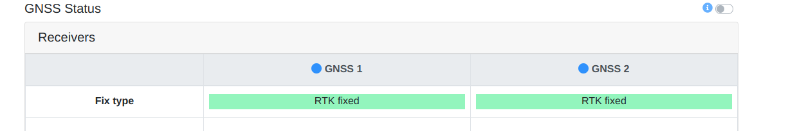
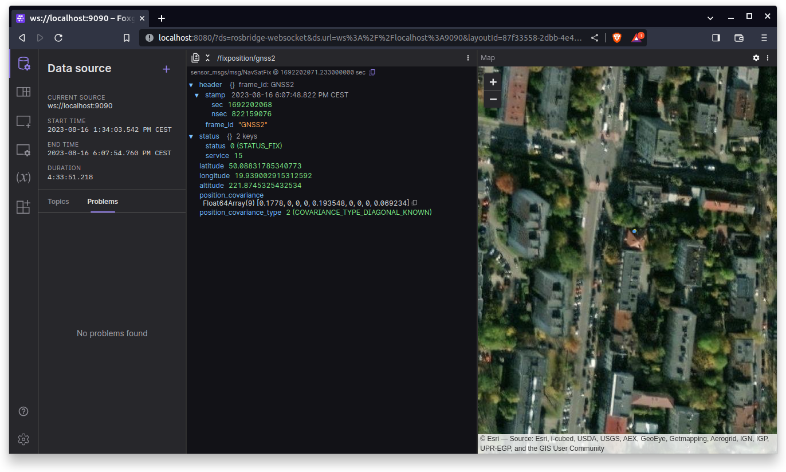

# Fixposition Vision-RTK 2 demo

First, follow the [Quickstart guide](https://uploads-ssl.webflow.com/623c5f1910ae850ac3ba2058/6374941f2d8df215f2e88339_Quick%20Starter%20Guide%20%20EN.pdf) to set up the sensor (RTK is necessary for fusion mode).

Connect to your device either using WiFi or Ethernet (when using an Ethernet connection it will be necessary to adjust the IP address configuration in the `tcp.yaml`, for example for Panther you should use `10.15.20.20`).
Additionally when running on Panther it may be necessary to change your IP address (`ROS_IP`) set in the `compose.yml`.

Before starting containers make sure that sensor with fusion started properly (unless you want to use only GNSS data).
You may need to start the fusion manually (in the configuration tab it can be changed to autostart).
Fusion starts after GNSS localization with RTK information was received.
Please connect to the sensor's page using the sensor's IP address - the default address when using WiFi is `10.0.1.1`, there you can monitor the current status.
You should place your sensor outside and wait for it to find GNSS localization and RTK correction. Here is what your GNSS Status page should look like:

Then you should also see the State estimate on the Fusion Status webpage:


Finally, you can pull and execute containers: 
```bash
docker compose pull
```

```bash
docker compose up
```

In your browser (Chrome/Chromium or related browsers are recommended) go to Foxglove:
`localhost:8080`

Now click the plus sign next to the `Data source` in the left top corner, select `Open connection` and set the `WebSocket URL` to `ws://localhost:9090`, finally click `Open`. The final result should look like this:


> To drive the Panther around you can use WebUI, Gamepad or teleop_twist_keyboard (for details please refer to the [manual](https://husarion.com/manuals/panther/#controlling-panther-robot)).
